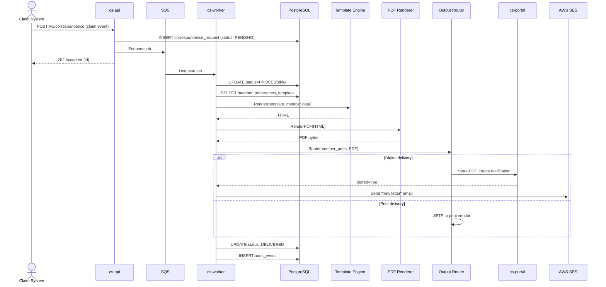
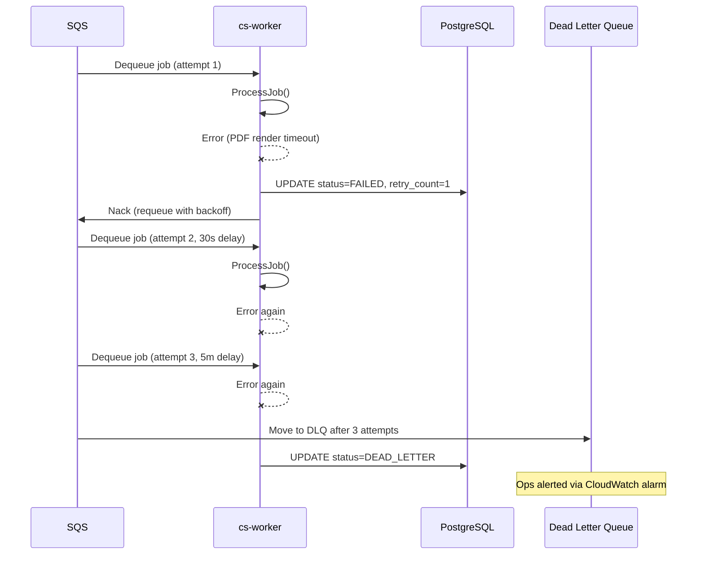
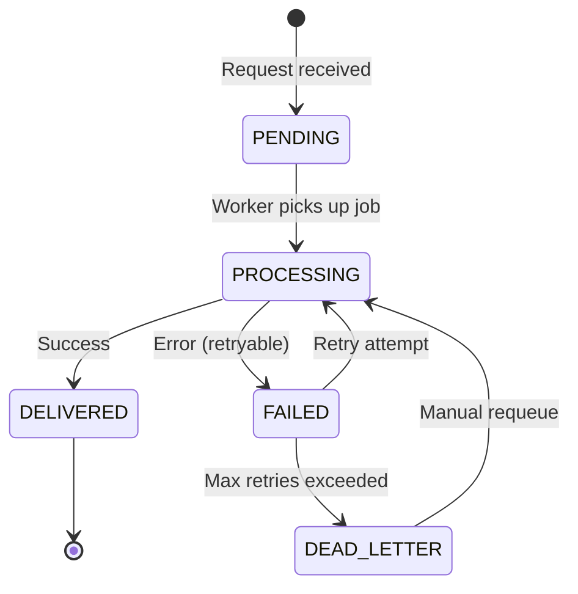

# Data Flow

End-to-end sequence for a single correspondence item — from trigger to delivery confirmation.

## Happy path

```mermaid
sequenceDiagram
    actor Trigger as Claim System
    participant API as cs-api
    participant Queue as SQS
    participant Worker as cs-worker
    participant DB as PostgreSQL
    participant Tmpl as Template Engine
    participant PDF as PDF Renderer
    participant Router as Output Router
    participant Portal as cs-portal
    participant SES as AWS SES

    Trigger->>API: POST /v1/correspondence (claim event)
    API->>DB: INSERT correspondence_request (status=PENDING)
    API->>Queue: Enqueue job
    API-->>Trigger: 202 Accepted {id}

    Queue->>Worker: Dequeue job
    Worker->>DB: UPDATE status=PROCESSING
    Worker->>DB: SELECT member, preferences, template
    Worker->>Tmpl: Render(template, member data)
    Tmpl-->>Worker: HTML

    Worker->>PDF: RenderPDF(HTML)
    PDF-->>Worker: PDF bytes

    Worker->>Router: Route(member_prefs, PDF)

    alt Digital delivery
        Router->>Portal: Store PDF, create notification
        Portal-->>Worker: stored=true
        Worker->>SES: Send "new letter" email
    else Print delivery
        Router->>Router: SFTP to print vendor
    end

    Worker->>DB: UPDATE status=DELIVERED
    Worker->>DB: INSERT audit_event
```

## Error / retry flow

```mermaid
sequenceDiagram
    participant Queue as SQS
    participant Worker as cs-worker
    participant DB as PostgreSQL
    participant DLQ as Dead Letter Queue

    Queue->>Worker: Dequeue job (attempt 1)
    Worker->>Worker: ProcessJob()
    Worker--xWorker: Error (PDF render timeout)
    Worker->>DB: UPDATE status=FAILED, retry_count=1
    Worker->>Queue: Nack (requeue with backoff)

    Queue->>Worker: Dequeue job (attempt 2, 30s delay)
    Worker->>Worker: ProcessJob()
    Worker--xWorker: Error again

    Queue->>Worker: Dequeue job (attempt 3, 5m delay)
    Worker--xWorker: Error again

    Queue->>DLQ: Move to DLQ after 3 attempts
    Worker->>DB: UPDATE status=DEAD_LETTER
    note over DLQ: Ops alerted via CloudWatch alarm
```

## Status state machine

```mermaid
stateDiagram-v2
    [*] --> PENDING: Request received
    PENDING --> PROCESSING: Worker picks up job
    PROCESSING --> DELIVERED: Success
    PROCESSING --> FAILED: Error (retryable)
    FAILED --> PROCESSING: Retry attempt
    FAILED --> DEAD_LETTER: Max retries exceeded
    DEAD_LETTER --> PROCESSING: Manual requeue
    DELIVERED --> [*]
```
