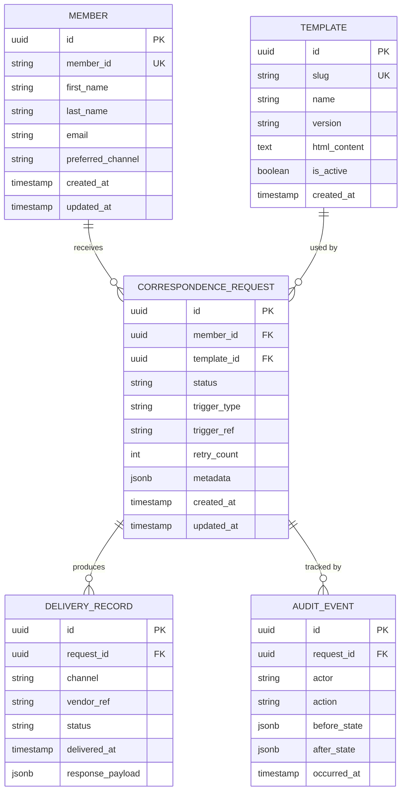

# Database Schema

PostgreSQL schema for the `cs-db` database. All tables are in the `correspondence` schema.

## Entity relationships



## Key indexes

```sql
-- Hot path: worker picks up pending jobs
CREATE INDEX idx_requests_status_created
    ON correspondence.correspondence_request(status, created_at)
    WHERE status IN ('PENDING', 'FAILED');

-- Member history lookup
CREATE INDEX idx_requests_member_id
    ON correspondence.correspondence_request(member_id, created_at DESC);

-- Audit log queries by request
CREATE INDEX idx_audit_request_id
    ON correspondence.audit_event(request_id, occurred_at DESC);
```

## Migrations

Migrations live in `src/api/Migrations/` and run automatically on startup via EF Core.
