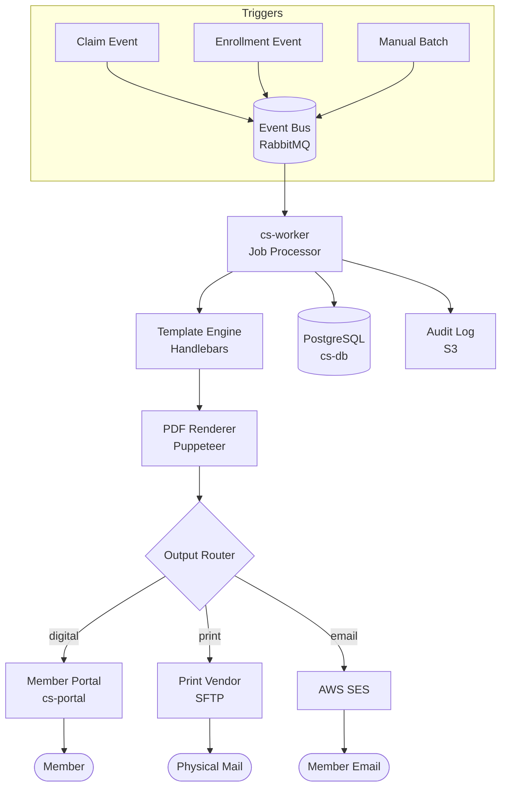
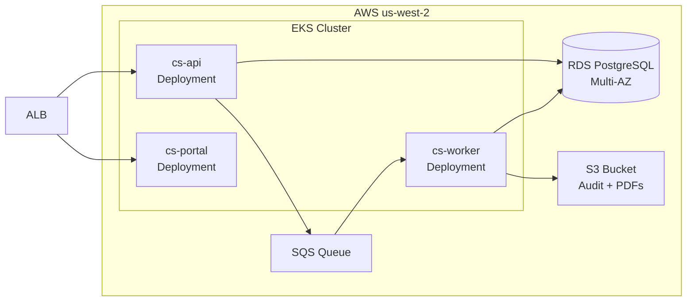

# System Overview

The Correspondence System is a pipeline: triggers come in, letters are composed, routed to the right output channel, and delivered. Here's the full picture.

## High-level architecture

## Component responsibilities

| Component | Language | Owns |
|-----------|----------|------|
| `cs-api` | .NET 8 | REST endpoints, auth, request validation |
| `cs-worker` | .NET 8 | Job queue, template rendering, output routing |
| `cs-portal` | React | Digital correspondence viewer |
| `cs-infra` | Terraform | AWS infra, RDS, SQS, SES |

## Deployment topology

## Related docs

- [Data Flow](data-flow.md)
- [Database Schema](database-schema.md)
- [Kubernetes Deployment](../infrastructure/deployment/kubernetes.md)
