# P1 Incident Response

A P1 means member correspondence is not being delivered. Follow this sequence.

## Response timeline

```mermaid
gantt
    title P1 Response Timeline
    dateFormat mm
    axisFormat %M min

    section Detection
    Alert fires            :milestone, 00, 0min
    On-call acknowledged   :crit, ack, 00, 2min

    section Assessment
    Identify blast radius  :active, assess, after ack, 5min
    Engage second on-call  :after ack, 3min

    section Mitigation
    Apply mitigation       :mit, after assess, 10min
    Verify queues draining :after mit, 5min

    section Communication
    Stakeholder update #1  :after ack, 1min
    Stakeholder update #2  :after mit, 1min

    section Resolution
    Confirm delivery resumed :milestone, after mit, 0min
    Write incident doc     :after mit, 15min
```



## Step-by-step

### 1. Acknowledge (0–2 min)

- Acknowledge the PagerDuty alert
- Join `#cs-incidents` Slack channel
- Post: `🚨 Acknowledging P1 — investigating now. CC @cs-oncall-secondary`

### 2. Assess (2–7 min)

```bash
# Is the API up?
curl -s https://cs-api.selecthealth.org/health | jq .

# Is the worker running?
kubectl get pods -n correspondence

# Queue depth?
aws sqs get-queue-attributes \
  --queue-url https://sqs.us-west-2.amazonaws.com/.../cs-jobs \
  --attribute-names ApproximateNumberOfMessages ApproximateNumberOfMessagesNotVisible
```

### 3. Mitigate

| Scenario | Action |
|----------|--------|
| Worker crash loop | `kubectl rollout undo deployment/cs-worker -n correspondence` |
| Bad deploy | Roll back in GitHub Actions (re-run previous deploy) |
| DB connection exhausted | Restart API + worker pods to reset pool |
| SQS permissions broke | Check IAM role, re-attach policy |

### 4. Communicate

Post to `#cs-incidents` every 10 min until resolved:

```
Update [HH:MM]: <what's happening>, <what we tried>, <next step>, ETA <time>
```

### 5. Resolve & document

Within 24h of resolution, file an incident doc in `runbooks/incidents/postmortems/YYYY-MM-DD-<slug>.md`.
