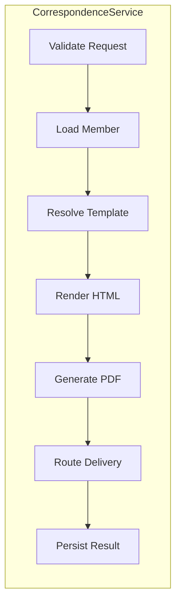

# CorrespondenceService

The core domain service inside `cs-worker`. Orchestrates the full lifecycle of a correspondence item.

## Responsibilities



## Interface

```csharp
public interface ICorrespondenceService
{
    Task<CorrespondenceResult> ProcessAsync(
        CorrespondenceJob job,
        CancellationToken ct = default);
}
```

## Dependencies

| Dependency | Interface | Purpose |
|------------|-----------|---------|
| `ITemplateEngine` | Handlebars | Renders template HTML |
| `IPdfRenderer` | Puppeteer | HTML → PDF |
| `IOutputRouter` | — | Sends to channel |
| `ICorrespondenceRepository` | EF Core | Persistence |
| `IAuditLogger` | — | Audit trail to S3 |

## Error handling

All exceptions are caught at the job boundary. Transient errors (`PdfRenderTimeoutException`, `SqsException`) trigger a requeue with exponential backoff. Permanent errors (`MemberNotFoundException`, `TemplateNotFoundException`) mark the job as `DEAD_LETTER` immediately without retrying.
